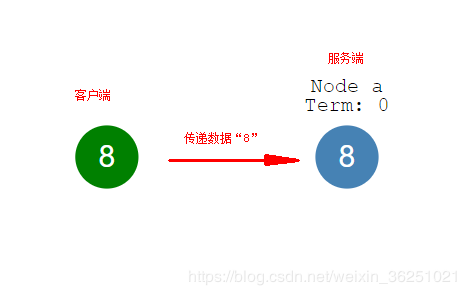

## 什么是Raft
让我们假设有一个单一节点系统，你可以将节点视为存储单个值的数据库服务器。同时有一个客户端可以发送数据到服务器，在一个节点上达成一致或共识是很容易的：

但是如果我们有很多个节点该如何达成共识？这个问题就叫做分布式共识
## 协议概述
Raft是实现分布式共识的协议。让我们看一下它是如何工作的。假设一个节点可以为三种状态中的一种：
 - 跟随者（Follower）
 - 候选者（Candidate ）
 - 领导者（Leader ）
所有的节点起始状态都为跟随者，跟随者在没有领导者的时候变为候选者，每个候选者从其他节点请求投票，节点会返回他们的投票。如果一个候选者得到了大多数选票则可以变为领导者，这个过程叫投票选举（Leader Election）。
现在所有的变化都需要通过领导者完成，每次改变都被保存到节点日志中，这个日志条目目前是未提交的，因此它不会更新节点的值。要提交条目，节点会首先将其复制到follower节点…然后，leader等待，直到大多数节点已经将值写入节点日志。现在leader节点已经提交了值为5。

然后leader节点通知follower节点并同步数据，现在整个集群已经达成了共识，这个过程称为日志复制。

## 节点选举
- 超时选举
Follower 等待变为Condidate的时间随机超时150ms到300ms，超时过后，即当有一个节点先变为Condidate时就开始一轮选举。Condidate向其他节点请求投票，如果接收到请求节点在本期还没有投票，那么它会投票给Condidate……然后重置超市选举，即重新延迟一段时间。直到一个Condidate得到大多数选票成为Leader 。
选举出 Leader 后 Leader 会定期向所有 Follower 发送 heartbeat 来维护其 Leader 地位，如果 Follower 一段时间后未收到 Leader 的心跳则认为 Leader 已经挂掉，便转变自身角色为 Condidate，同时发起新一轮的选举，产生新的 Leader。
两个节点同时变为Condidate收集选票则会导致这两个节点票数一致无法选举出结果，等待下一轮选举，由于随机延迟所以不会陷入死循环。
## 一致性策略
Raft 协议强依赖 Leader 节点来确保集群数据一致性。即 client 发送过来的数据均先到达 Leader 节点，Leader 接收到数据后，先将数据标记为 uncommitted 状态，随后 Leader 开始向所有 Follower 复制数据并等待响应，在获得集群中大于 N/2 个 Follower 的已成功接收数据完毕的响应后，Leader 将数据的状态标记为 committed，随后向 client 发送数据已接收确认，在向 client 发送出已数据接收后，再向所有 Follower 节点发送通知表明该数据状态为committed。

## Raft如何处理 Leader 意外的？
client 发送数据到达 Leader 之前 Leader 就挂了，因为数据还没有到达集群内部，所以对集群内部数据的一致性没有影响，Leader 挂了之后，集群会进行新的选举产生新的 Leader，之前挂掉的 Leader 重启后作为 Follower 加入集群，并同步 Leader 上的数据。这里最好要求 client 有重试机制在一定时间没有收到 Leader 的数据已接收确认后进行一定次数的重试，并再次向新的 Leader 发送数据来确保业务的流畅性。

client 发送数据到 Leader，数据到达 Leader 后，Leader 还没有开始向 Folloers 复制数据，Leader就挂了，此时数据仍被标记为 uncommited 状态，这时集群会进行新的选举产生新的 Leader，之前挂掉的 Leader 重启后作为 Follower 加入集群，并同步 Leader 上的数据，来保证数据一致性，之前接收到 client 的数据由于是 uncommited 状态所以可能会被丢弃。这里同样最好要求 client 有重试机制通过在一定时间在没有收到 Leader 的数据已接收确认后进行一定次数的重试，再次向新的 Leader 发送数据来确保业务的流畅性。

client 发送数据到 Leader, Leader 接收数据完毕后标记为 uncommited，开始向 Follower复制数据，在复制完毕一小部分 Follower 后 Leader 挂了，此时数据在所有已接收到数据的 Follower 上仍被标记为 uncommitted，此时集群将进行新的选举，而拥有最新数据的 Follower 变换角色为 Condidate，也就意味着 Leader 将在拥有最新数据的 Follower 中产生，新的 Leader 产生后所有节点开始从新 Leader 上同步数据确保数据的一致性，包括之前挂掉后恢复了状态的 老Leader，这时也以 Follower 的身份同步新 Leader 上的数据。

client 发送数据到 Leader，Leader 接收数据完毕后标记为 uncommitted，开始向 Follower 复制数据，在复制完毕所有 Follower 节点或者大部分节点（大于 N/2），并接收到大部分节点接收完毕的响应后，Leader 节点将数据标记为 committed，这时 Leader 挂了，此时已接收到数据的所有 Follower 节点上的数据状态由于还没有接收到 Leader 的 commited 通知，均处于 uncommited 状态。这时集群进行了新的选举，新的 Leader 将在拥有最新数据的节点中产生，新的 Leader 产生后，由于 client 端因老 Leader 挂掉前没有通知其数据已接收，所以会向新的 Leader 发送重试请求，而新的 Leader 上已经存在了这个之前从老 Leader 上同步过来的数据，因此 Raft 集群要求各节点自身实现去重的机制，保证数据的一致性。

集群分裂的一致性处理，多发于双机房的跨机房模式的集群。假设一个 5 节点的 Raft 集群，其中三个节点在 A 机房，Leader 节点也在 A 机房，两个节点在 B 机房。突然 A、B 两个机房之间因其他故障无法通讯，那么此时 B 机房中的 2 个Follower 因为失去与 Leader 的联系，均转变自身角色为 Condidate。根据 Leader 选举机制，B 机房中产生了一个新的 Leader，这就发生了脑裂即存在 A 机房中的老 Leader 的集群与B机房新 Leader 的集群。Raft 针对这种情况的处理方式是老的 Leader 集群虽然剩下三个节点，但是 Leader 对数据的处理过程还是在按原来 5 个节点进行处理，所以老的 Leader 接收到的数据，在向其他 4 个节点复制数据，由于无法获取超过 N/2 个 Follower 节点的复制完毕数据响应（因为无法连接到 B 机房中的 2个节点），所以 client 在向老 Leader 发送的数据请求均无法成功写入，而 client 向B机房新 Leader 发送的数据，因为是新成立的集群，所以可以成功写入数据，在A、B两个机房恢复网络通讯后，A 机房中的所有节点包括老 Leader 再以 Follower 角色接入这个集群，并同步新 Leader 中的数据，完成数据一致性处理。

